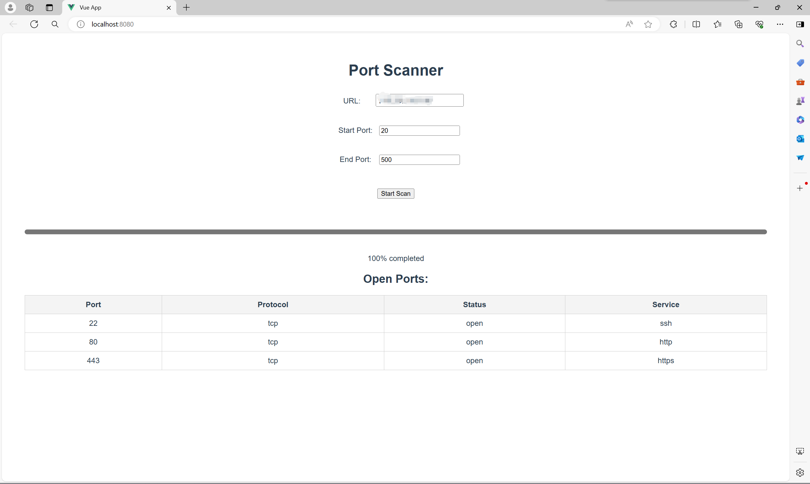

# Port-Scanning
Network Security Coursework: Programming a Simple Port Scanning Software

## Usage

### 启动后端

```bash

cd back-end
python app.py

```

### 启动前端

```bash

cd front-end
npm install
npm run serve

```

## Effect


